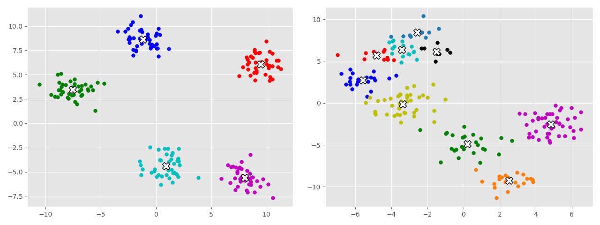

# Machine Learning Research

This repository is dedicated to my own machine learning research, in essence implementations of algorithms
from scratch as I attempt to learn them, construction of existing model architectures to attempt to get an understanding
of the internal functions of them, or experimentation with different algorithms and constructs to see their result.

Most of the implementations here are from scratch, using only NumPy and Matplotlib in order to use basic linear algebra operations 
and visualize data, respectively, but the high-level neural network and other model construct implementations make use of
the [Tensorflow](https://github.com/tensorflow/tensorflow) and [PyTorch](https://github.com/pytorch/pytorch) libraries.

I primarily make these implementations in Python, due to not only the number of libraries but also because of the sheer ease that 
is writing code in Python (at least to me). However, sometimes when testing optimization I will add constructs in C++.

While currently I have been primarily experimenting with supervised learning techniques, e.g. regression and even basic classification
using SVM/LDA, I have also tinkered with unsupervised learning, e.g. K-Means clustering (as pictured above), and PCA.

## Navigation

The directory names are quite literal, so to find different algorithms you can find the directory that contains the name 
and then navigate through its subdirectories if necessary. Some directories that may need explanation (a dynamic list):

- The `nn-basic` directory contains any implementations of neural networks from when I was first working with neural networks. 
For example, my initial MNIST digit classification network resides there.

## Implementations

What use is there in constructing these algorithms if they are not applied to anything? The `implementations` directory contains actual
usage of selected algorithms I've constructed on actual datasets, alongside a comparison to the [scikit-learn](https://github.com/scikit-learn/scikit-learn)
implementation of the same algorithm (on the same dataset). Some implementations to note (a growing list) include:

1.  **Logistic Regression**: Implemented the Logistic Regression algorithm on the [Pima Indians Diabetes](https://www.kaggle.com/uciml/pima-indians-diabetes-database/discussion) 
Dataset. On a train/test split of 0.75/0.25, the algorithm achieves an accuracy of 81.8%, compared to the scikit-learn equivalent of 82.4%.

## Experimentation

The `experimental` directory is a special directory, as anything in there is purely experimental research and often may not even function 
as intended to. In these cases, I try and determine exactly what the issue is that prevents the algorithm from functioning correctly. More 
information can be found in the directory of that README.

## License

All of the algorithms, constructs, and implementations in this library are licensed under the MIT License. You are free to work with them as you desire.

